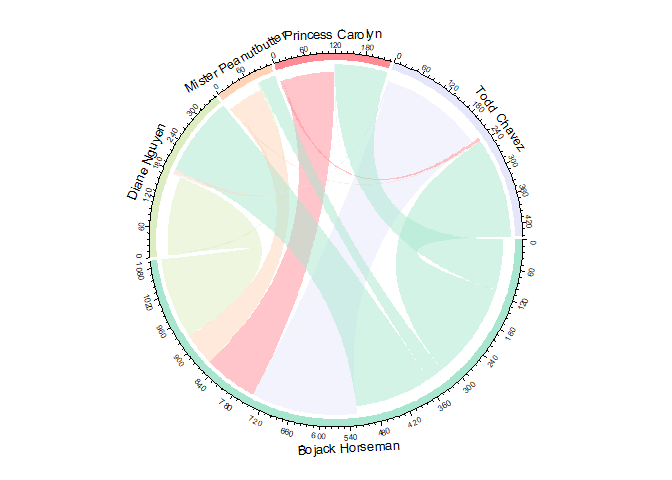

# Character Interactions

The frequency count of references to characters provides some useful
information regarding how much a character is a focus of conversation.
However, what would be more informative would be to consider how
frequently characters speak, and to whom, rather than how often their
name is mentioned. This requires substantial transcription, and I have
currently only completed a limited amount. However, we can test this as
a proof of concept, that can be further developed moving forward.

``` r
relations <-  read_csv("BojackAnnotated.csv") %>%
              mutate(Speaker = as.factor(Speaker), Listeners = as.factor(Listeners)) %>%
              select(-Timecode.in, -Timecode.out, -Others, -`Conversation Number`, -`Cut-Away`)
```

``` r
              head(relations) %>% kable("html") %>%
              kable_styling(bootstrap_options = c("striped", "hover"))
```

<table class="table table-striped table-hover" style="margin-left: auto; margin-right: auto;">

<thead>

<tr>

<th style="text-align:right;">

Line

</th>

<th style="text-align:left;">

Text

</th>

<th style="text-align:right;">

season\_num

</th>

<th style="text-align:right;">

episode\_num

</th>

<th style="text-align:left;">

Speaker

</th>

<th style="text-align:left;">

Listeners

</th>

</tr>

</thead>

<tbody>

<tr>

<td style="text-align:right;">

1

</td>

<td style="text-align:left;">

Horsin’ Around is filmed before a live studio audience.

</td>

<td style="text-align:right;">

1

</td>

<td style="text-align:right;">

1

</td>

<td style="text-align:left;">

HA-H

</td>

<td style="text-align:left;">

NA

</td>

</tr>

<tr>

<td style="text-align:right;">

2

</td>

<td style="text-align:left;">

Mondays.

</td>

<td style="text-align:right;">

1

</td>

<td style="text-align:right;">

1

</td>

<td style="text-align:left;">

HA-S

</td>

<td style="text-align:left;">

HA-H

</td>

</tr>

<tr>

<td style="text-align:right;">

3

</td>

<td style="text-align:left;">

Well, good morning to you too.

</td>

<td style="text-align:right;">

1

</td>

<td style="text-align:right;">

1

</td>

<td style="text-align:left;">

HA-H

</td>

<td style="text-align:left;">

HA-S

</td>

</tr>

<tr>

<td style="text-align:right;">

4

</td>

<td style="text-align:left;">

Oh, hey.

</td>

<td style="text-align:right;">

1

</td>

<td style="text-align:right;">

1

</td>

<td style="text-align:left;">

HA-S

</td>

<td style="text-align:left;">

HA-H

</td>

</tr>

<tr>

<td style="text-align:right;">

5

</td>

<td style="text-align:left;">

Where? I’d love hay.

</td>

<td style="text-align:right;">

1

</td>

<td style="text-align:right;">

1

</td>

<td style="text-align:left;">

HA-H

</td>

<td style="text-align:left;">

HA-S

</td>

</tr>

<tr>

<td style="text-align:right;">

6

</td>

<td style="text-align:left;">

In 1987, the situation comedy Horsin’ Around

</td>

<td style="text-align:right;">

1

</td>

<td style="text-align:right;">

1

</td>

<td style="text-align:left;">

CR

</td>

<td style="text-align:left;">

BH

</td>

</tr>

</tbody>

</table>

The next step is to create an adjacency list, counting the interactions
between each speaker and each listener.

``` r
MajorListeners <- relations %>%
              mutate(`Bojack Horseman` = ifelse(Listeners %in% "BH",T,F),
                     `Diane Nguyen` = ifelse(Listeners %in% "DN",T,F),
                     `Mister Peanutbutter` = ifelse(Listeners %in% "MP",T,F),
                     `Todd Chavez` = ifelse(Listeners %in% "TC",T,F),
                     `Princess Carolyn` = ifelse(Listeners %in% "PC",T,F),
                     `Extra` = ifelse(!Listeners %in% c("BH","DN","MP","TC","PC"),T,F) 
                     ) %>%
              select(-episode_num, -season_num, -Line)
```

This gives us a matrix of speakers and Listeners, with the speaker kept
as a factor, and each major character as a logical element. The main
issue is that if **multiple** listeners are involved in a discussion,
they are not recorded individually, but instead as an EXTRA. This
requires further attention in order to correct it.

The next step is to sum the interactions between each
character:

``` r
SummaryList <- MajorListeners %>% filter(Speaker %in% c("Bojack Horseman","Diane Nguyen", "Mister Peanutbutter", "Todd Chavez", "Princess Carolyn")) %>% group_by(Speaker) %>% summarise(`Bojack Horseman` = sum(`Bojack Horseman`), `Diane Nguyen` = sum(`Diane Nguyen`), `Mister Peanutbutter` = sum(`Mister Peanutbutter`), `Todd Chavez` = sum(`Todd Chavez`), `Princess Carolyn` = sum(`Princess Carolyn`)) %>% gather(Listener, Count, -Speaker)

SummaryList %>% kable("html") %>% kable_styling(bootstrap_options = c("striped", "hover"))
```

<table class="table table-striped table-hover" style="margin-left: auto; margin-right: auto;">

<thead>

<tr>

<th style="text-align:left;">

Speaker

</th>

<th style="text-align:left;">

Listener

</th>

<th style="text-align:right;">

Count

</th>

</tr>

</thead>

<tbody>

<tr>

<td style="text-align:left;">

Bojack Horseman

</td>

<td style="text-align:left;">

Bojack Horseman

</td>

<td style="text-align:right;">

0

</td>

</tr>

<tr>

<td style="text-align:left;">

Diane Nguyen

</td>

<td style="text-align:left;">

Bojack Horseman

</td>

<td style="text-align:right;">

169

</td>

</tr>

<tr>

<td style="text-align:left;">

Mister Peanutbutter

</td>

<td style="text-align:left;">

Bojack Horseman

</td>

<td style="text-align:right;">

67

</td>

</tr>

<tr>

<td style="text-align:left;">

Princess Carolyn

</td>

<td style="text-align:left;">

Bojack Horseman

</td>

<td style="text-align:right;">

113

</td>

</tr>

<tr>

<td style="text-align:left;">

Todd Chavez

</td>

<td style="text-align:left;">

Bojack Horseman

</td>

<td style="text-align:right;">

223

</td>

</tr>

<tr>

<td style="text-align:left;">

Bojack Horseman

</td>

<td style="text-align:left;">

Diane Nguyen

</td>

<td style="text-align:right;">

168

</td>

</tr>

<tr>

<td style="text-align:left;">

Diane Nguyen

</td>

<td style="text-align:left;">

Diane Nguyen

</td>

<td style="text-align:right;">

0

</td>

</tr>

<tr>

<td style="text-align:left;">

Mister Peanutbutter

</td>

<td style="text-align:left;">

Diane Nguyen

</td>

<td style="text-align:right;">

7

</td>

</tr>

<tr>

<td style="text-align:left;">

Princess Carolyn

</td>

<td style="text-align:left;">

Diane Nguyen

</td>

<td style="text-align:right;">

0

</td>

</tr>

<tr>

<td style="text-align:left;">

Todd Chavez

</td>

<td style="text-align:left;">

Diane Nguyen

</td>

<td style="text-align:right;">

3

</td>

</tr>

<tr>

<td style="text-align:left;">

Bojack Horseman

</td>

<td style="text-align:left;">

Mister Peanutbutter

</td>

<td style="text-align:right;">

36

</td>

</tr>

<tr>

<td style="text-align:left;">

Diane Nguyen

</td>

<td style="text-align:left;">

Mister Peanutbutter

</td>

<td style="text-align:right;">

4

</td>

</tr>

<tr>

<td style="text-align:left;">

Mister Peanutbutter

</td>

<td style="text-align:left;">

Mister Peanutbutter

</td>

<td style="text-align:right;">

0

</td>

</tr>

<tr>

<td style="text-align:left;">

Princess Carolyn

</td>

<td style="text-align:left;">

Mister Peanutbutter

</td>

<td style="text-align:right;">

0

</td>

</tr>

<tr>

<td style="text-align:left;">

Todd Chavez

</td>

<td style="text-align:left;">

Mister Peanutbutter

</td>

<td style="text-align:right;">

0

</td>

</tr>

<tr>

<td style="text-align:left;">

Bojack Horseman

</td>

<td style="text-align:left;">

Todd Chavez

</td>

<td style="text-align:right;">

210

</td>

</tr>

<tr>

<td style="text-align:left;">

Diane Nguyen

</td>

<td style="text-align:left;">

Todd Chavez

</td>

<td style="text-align:right;">

0

</td>

</tr>

<tr>

<td style="text-align:left;">

Mister Peanutbutter

</td>

<td style="text-align:left;">

Todd Chavez

</td>

<td style="text-align:right;">

3

</td>

</tr>

<tr>

<td style="text-align:left;">

Princess Carolyn

</td>

<td style="text-align:left;">

Todd Chavez

</td>

<td style="text-align:right;">

6

</td>

</tr>

<tr>

<td style="text-align:left;">

Todd Chavez

</td>

<td style="text-align:left;">

Todd Chavez

</td>

<td style="text-align:right;">

0

</td>

</tr>

<tr>

<td style="text-align:left;">

Bojack Horseman

</td>

<td style="text-align:left;">

Princess Carolyn

</td>

<td style="text-align:right;">

109

</td>

</tr>

<tr>

<td style="text-align:left;">

Diane Nguyen

</td>

<td style="text-align:left;">

Princess Carolyn

</td>

<td style="text-align:right;">

0

</td>

</tr>

<tr>

<td style="text-align:left;">

Mister Peanutbutter

</td>

<td style="text-align:left;">

Princess Carolyn

</td>

<td style="text-align:right;">

0

</td>

</tr>

<tr>

<td style="text-align:left;">

Princess Carolyn

</td>

<td style="text-align:left;">

Princess Carolyn

</td>

<td style="text-align:right;">

0

</td>

</tr>

<tr>

<td style="text-align:left;">

Todd Chavez

</td>

<td style="text-align:left;">

Princess Carolyn

</td>

<td style="text-align:right;">

2

</td>

</tr>

</tbody>

</table>

Finally, we develop the Chord Diagram:

``` r
chordColour = c("#a8e6cf",
                "#dcedc1",
                "#ffd3b6",
                "#ff8b94",
                "#e6e6fa")

chordDiagram(SummaryList, grid.col = chordColour, directional = T)
```

<!-- -->

``` r
circos.clear()
```

``` r
chordColour = c("#a8e6cf",
                "#dcedc1",
                "#ffd3b6",
                "#ff8b94",
                "#e6e6fa")

chordDiagram(SummaryList, grid.col = chordColour, directional = T)
```

<!-- -->

``` r
circos.clear()
```

This plot shows the proportion of dialogue spoken to and by a character.
The anti-clockwise side of the segment (in their colour) shows how many
lines of dialogue the character speaks, and to whom they address it. The
multicolored clockwise segment shows the proportion of dialogue
addressed to them by others, showing how this is divided by speakers.
Thus, we can see that in the first 4 episodes it is Bojack’s
relationships that dominate the show. This is understandable as he is
the titular character.

Bojack and Todd have the most interactions with each other in this
time-period, and most of the relationships seem roughly equal between
speaking and listening.

What would be interesting would be to compare the circular plots of
early episodes with later seasons, seeing if the ensemble cast take on a
greater proportion of the interactions.

I could select a random later episode to transcribe out of order in
order to compare these dynamics, and will provide further results when
this is complete.
