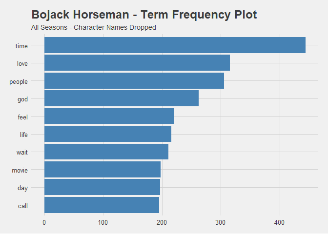

# Tidytext Analysis

The first step of Tidytext analysis is to `unnest_tokens` and break down
th entire script to single words. Then, we remove **stop-words**, those
words that add little to any particular analysis. There is a default
list of stop-words available, that has been amended with similar terms
from the show. Abbreviations, such as “gonna” and “wanna”, have had to
be removed, as well as the sound “na”, which has remained in some
episodes where the end of show lyrics are included.

These lyrics have also likely skewed the term frequencies with repeated
lines, but this can be confirmed when the lines are manually filtered
while transcribing the speakers of each line of
dialogue.

``` r
s1Raw <- read.subtitles.season("Bojack SRT/Bojack S1 SRT/") %>% subDataFrame()
```

    ## Read: 12 episodes

``` r
s2Raw <- read.subtitles.season("Bojack SRT/Bojack S2 SRT/") %>% subDataFrame()
```

    ## Read: 12 episodes

``` r
s3Raw <- read.subtitles.season("Bojack SRT/Bojack S3 SRT/") %>% subDataFrame()
```

    ## Read: 12 episodes

``` r
s4Raw <- read.subtitles.season("Bojack SRT/Bojack S4 SRT/") %>% subDataFrame()
```

    ## Read: 12 episodes

``` r
all_s_Raw <- rbind(s1Raw,s2Raw,s3Raw,s4Raw) %>%
  filter(!str_detect(.$Text, "7ed")) %>% # Removes the sync information.
  filter(!str_detect(.$Text, "[0-9]x")) %>% # Removes episode title
  rename(Line = ID) %>% # Avoids Excel error of reading CSV files as corrupted if column 1 is named "ID"
  mutate(Line = str_remove_all(Line, "\\D"))
```

``` r
tidy_bojack <- all_s_Raw %>% unnest_tokens(word, Text)
data("stop_words")
stop_words %<>% rbind("yeah","hey","uh","na","gonna", "wanna", "gotta")
tidy_bojack %<>% anti_join(stop_words, by = "word")
```

Following the preparation of the script into a tidy data frame, we can
plot the term frequency of the show, as well as each season, to see how
the text of the show is made
up:

``` r
tidy_bojack %>% count(word, sort = T) %>% arrange(word, desc(n)) %>% top_n(10) %>%
        ggplot(aes(reorder(word,n),n)) +
        geom_bar(stat = "identity", fill = "steelblue") +
        coord_flip() +
        labs(x = NULL) +
        guides(fill = FALSE) +
        ggtitle("Bojack Horseman - Term Frequency Plot", "All Seasons")
```

<!-- -->

Not too surprising for raw frequency. The main character’s name is
repeated nearly 900 times in the course of the series. That averages at
18.75 times per episode. That’s not too hard to believe, especially if
the lyrics of the credits song are sometimes included 4-5 times, which
could account for roughly an additional 240 occurrences.

Notably, 4 of the most frequent terms are the names of main characters.
If we also remove those, the term plot looks slightly
different:

``` r
tidy_bojack %>% filter(!word %in% c("bojack","diane","peanutbutter","todd")) %>%
        count(word, sort = T) %>% arrange(word, desc(n)) %>% top_n(10) %>%
        ggplot(aes(reorder(word,n),n)) +
        geom_bar(stat = "identity", fill = "steelblue") +
        coord_flip() +
        labs(x = NULL) +
        guides(fill = FALSE) +
        ggtitle("Bojack Horseman - Term Frequency Plot", "All Seasons - Character Names Dropped")
```

<!-- -->

This is quite interesting as the general terms seem non-specific.
However, the repeated use of “love” seems odd given the general themes
of the show. Though it should also be considered that neither Tidytext
analysis, nor any other natural language processing, is adept at picking
up sarcasm and
irony.

``` r
tidy_bojack %>% mutate(season = factor(season, levels = c("Bojack S1 SRT", "Bojack S2 SRT", "Bojack S3 SRT", "Bojack S4 SRT"))) %>%
        group_by(season) %>% count(season,word, sort = T) %>% arrange(season, desc(n)) %>% top_n(10) %>%
        ggplot(aes(reorder(word,n), n, fill = season)) +
        geom_bar(stat = "identity") +
        coord_flip() +
        facet_wrap(~season, scales = "free_y") +labs(x = NULL) +
        guides(fill = FALSE) +
        ggtitle("Bojack Horseman - Term Frequency Plot", "Divided by Season")
```

<!-- -->

When broken down by season, it is interesting that the character
references remain relatively consistent across the series. It is also
interesting that “love” and “god” are relatively frequent terms.
“Hollyhock” and “baby” becoming significant terms in the final season
also indicate the importance of those terms to the fourth season’s
plot.

``` r
tidy_bojack %>% mutate(season = factor(season, levels = c("Bojack S1 SRT", "Bojack S2 SRT", "Bojack S3 SRT", "Bojack S4 SRT"))) %>%
        filter(!word %in% c("bojack","diane","peanutbutter","todd", "hollyhock", "carolyn")) %>%
        group_by(season) %>% count(season,word, sort = T) %>% arrange(season, desc(n)) %>% top_n(10) %>%
        ggplot(aes(reorder(word,n), n, fill = season)) +
        geom_bar(stat = "identity") +
        coord_flip() +
        facet_wrap(~season, scales = "free_y") +labs(x = NULL) +
        guides(fill = FALSE) +
        ggtitle("Bojack Horseman - Term Frequency Plot", "Divided by Season, Character Names Dropped")
```

<!-- -->

Having dropped the names of characters, we can see more details of the
overall storyline in each season’s frequency plot:

1.  The writing of Bojack’s **book** is the source of Bojack’s
    interaction with Diane, and a constant factor in the plot.
2.  Starring in the Secretariat **movie** about a champion racing
    **horse** is BoJack’s ambition.
3.  Winning an **oscar** is the driver of many episodes following the
    movie’s filming.
4.  Bojack deals with his estranged **mom** and the mystery of who gave
    birth to his **baby**.

-----

These frequency plots, while not conveying the entirety of the storyline
or themes, do convey sufficient information that each season’s theme is
visible, with knowledge of the show.

The most interesting element is the recurrence of “time”, “love” and
“people”. “Love” may often be used sarcastically, but “time” and
“people” do not come up as specific themes. Therefore, their
consistency is notable.

This initial analysis is relatively simple, but has already shown the
potential of Tidytext analysis to infer useful information in a matter
of seconds.

In my next page, I will employ sentiment analysis to examine the
emotional use of language throughout the show.
