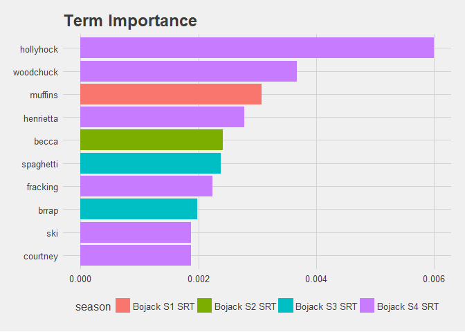
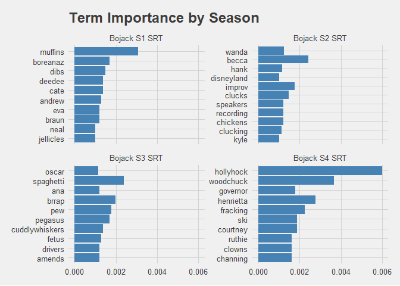

# Term Importance

## Term Frequency - Inverse Document Frequency

To quote [Silge & Robinson](https://www.tidytextmining.com/tfidf.html):

> Calculating tf-idf attempts to find the words that are important
> (i.e., common) in a text, but not too common.

TF-IDF considers the terms that are most frequent in a corpus, and the
term frequency within specific items of the corpus. A term that is
common in some, but not all, elements of a corpus may indicate that it
is more
significant

``` r
tf_idf_dfTOTAL <- tidy_bojack %>% mutate(EpID = as.factor(paste0(season_num, "x", episode_num))) %>%
        count(season, word, sort = TRUE) %>%
        bind_tf_idf(word, season, n)

tf_idf_dfTOTAL %>% mutate(word = reorder(word, tf_idf)) %>% top_n(10) %>% ggplot(aes(x=word, y=tf_idf, fill = season)) + geom_col() + coord_flip() + ggtitle("Term Importance") + ylab("TFIDF")
```

<!-- -->

``` r
tf_idf_dfSEASONS <- tidy_bojack %>%  group_by(season) %>% count(season, word, sort = TRUE) %>% bind_tf_idf(word, season, n) %>%  mutate(word = reorder(word, tf_idf)) %>% top_n(10) 

tf_idf_dfSEASONS %>% ggplot(aes(x=reorder(word,n), y=tf_idf)) + geom_col(fill = "steelblue") + coord_flip() + facet_wrap(~ season, scales = "free_y") + ggtitle("Term Importance by Season")
```

<!-- -->

This is an excellent example of how TF-IDF can identify terms that are
important due to their frequency, without being overpowering. In season
1, **muffins** are a key topic of one episode; in another, a biopic of
**Eva Braun** is a focal point of the B-Plot. Similarly, **chickens**
raise uncomfortable ethical implications in Season 2, and **Mister
Cuddlywhiskers** is a plot driver in Season 3. Most tellingly,
**Hollyhock** is an important character throughout Season 4, appearing
in the majority of episodes, however her name is marked with high
significance, as is **Henrietta**.

Thus, by examining the TF-IDF of the show, we drop all the main
characters for being too frequent in appearance. But we perfectly
identified the primary focus of Season 4.

-----

Since first drafting this, I have noticed that I may have misapplied the
TF-IDF function. The layout should be:

tbl | A tidy text dataset with one-row-per-term-per-document term |
Column containing terms as string or symbol document | Column containing
document IDs as string or symbol n | Column containing document-term
counts as string or symbol

However, I have used the dataset for one row - per term - per season.
Not per episode/document. This could be correctly applied for the first
chart, depending on how we wish to examine term significance,
e.g. looking for seasonal elements. But this is incorrectly applied for
the second focus on importance within the season. This bears further
examination and correction.

-----
